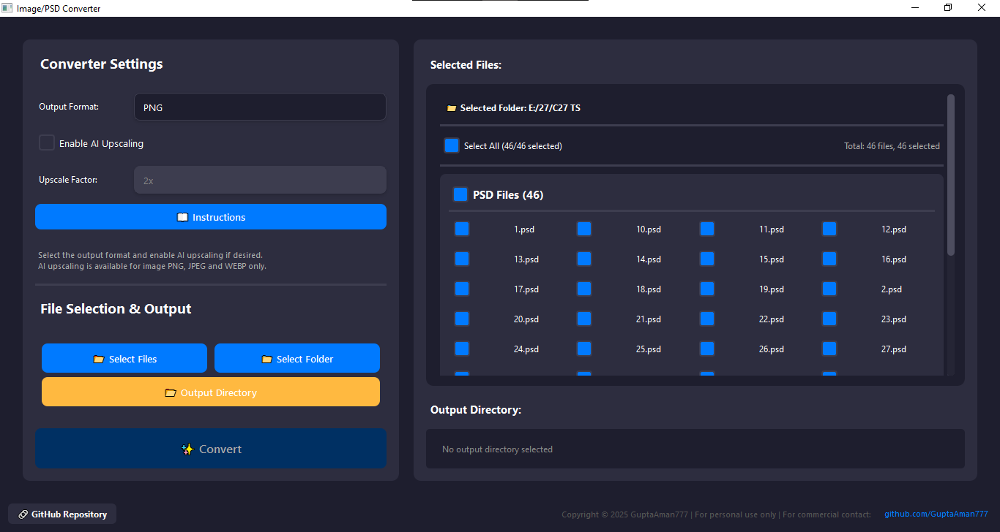

# Image & PSD Converter

A modern GUI application for converting images and PSD files between different formats, with support for AI upscaling using RealESRGAN.

## Features

- Convert between multiple image formats:
  - PNG
  - JPEG
  - BMP
  - GIF
  - TIFF
  - WEBP
  - PDF
  - PSD (Photoshop Documents)
- AI upscaling support using RealESRGAN
- Batch conversion support
- Modern, user-friendly interface
- Real-time progress tracking with ETA
- Customizable quality settings for each format
- GPU acceleration support for upscaling

## Download

Download the latest release from the [Releases](https://github.com/yourusername/ImageConverter/releases) page.

## Usage

1. Launch the application
2. Select your desired output format
3. Choose quality settings (optional)
4. Enable AI upscaling if desired (for supported formats)
5. Select input files or folders
6. Choose output location
7. Click "Convert" to begin

## Settings

### Image Quality Settings
- JPEG Quality: Maximum, High, Medium, Low
- WEBP Quality: Maximum, High, Medium, Low
- PNG Compression: Maximum, Normal, Fast, None

### PDF Settings
- Resolution: 72 DPI, 150 DPI, 300 DPI, 600 DPI
- Quality: High, Medium, Low

### Upscaling Options
- Available for: PNG, JPEG, WEBP
- Scale factors: 2x, 3x, 4x
- Requires compatible GPU for optimal performance

## System Requirements

- Windows 10 or later
- 4GB RAM minimum (8GB recommended)
- GPU with Vulkan support (for AI upscaling)
- 500MB free disk space

## Known Limitations

- PDF conversion currently supports single-page output
- Large PSD files may require additional memory
- Upscaling is limited to specific output formats

## Credits

This application uses the following open-source projects:
- [Real-ESRGAN](https://github.com/xinntao/Real-ESRGAN) for AI upscaling
- [PyQt6](https://www.riverbankcomputing.com/software/pyqt/) for the GUI
- [Pillow](https://python-pillow.org/) for image processing
- [psd-tools](https://psd-tools.readthedocs.io/) for PSD file support
