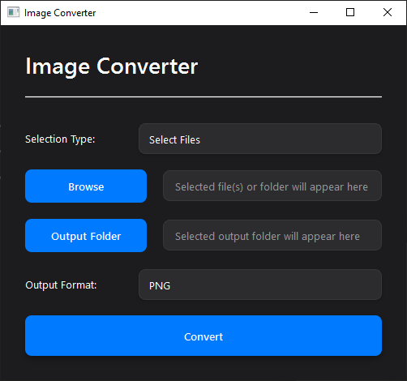

# PSD Converter

A powerful and user-friendly tool for converting PSD files and other image formats to various output formats.

## Features

- Convert PSD files to PNG, JPEG, BMP, GIF, TIFF, WEBP, and PDF
- Batch conversion support for multiple files
- Folder-based conversion for processing entire directories
- Optimized conversion settings for different file sizes
- Memory-efficient processing of large files
- Real-time progress tracking with ETA and speed indicators
- Modern, responsive UI with dark mode support

## Installation

1. Download the latest release from the [Releases](https://github.com/yourusername/psd-converter/releases) page
2. Extract the ZIP file (if applicable)
3. Run the `PSD Converter.exe` file

No installation required - the application is portable and ready to use!

## Usage

1. Select either "Select Files" or "Select Folder" from the dropdown
2. Click "Browse" to choose your input files or folder
3. Click "Output Folder" to select where converted files will be saved
4. Choose your desired output format from the dropdown
5. Click "Convert" to start the conversion process
6. View real-time progress and statistics during conversion

## Supported Formats

### Input Formats
- PSD (Adobe Photoshop)
- PNG
- JPEG/JPG
- BMP
- GIF
- TIFF
- WEBP
- PDF

### Output Formats
- PNG
- JPEG/JPG
- BMP
- GIF
- TIFF
- WEBP
- PDF

## System Requirements

- Windows 10 or later
- 4GB RAM minimum (8GB+ recommended for large PSD files)
- No additional software required

## Technical Details

The application uses:
- Python with PyQt6 for the UI
- PIL/Pillow for image processing
- psd-tools for PSD file handling
- Multi-threaded processing for improved performance
- Memory optimization techniques for handling large files

## License

[MIT License](LICENSE)

## Support

If you encounter any issues or have questions, please [open an issue](https://github.com/guptaaman777/psd-converter/issues) on GitHub.
